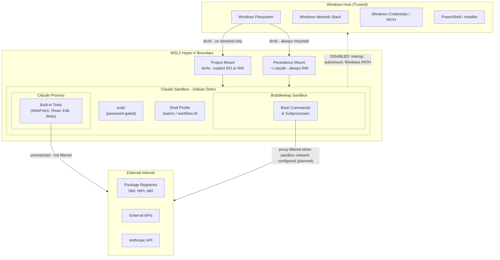

# Threat Model

## 1. Purpose and Scope

Claude Sandbox is a WSL2-based Debian environment on Windows that isolates Claude Code from the host system. This threat model covers threats arising from Claude Code's execution within the sandbox, including filesystem access, command execution, network activity, and privilege escalation. Out of scope: physical access attacks, nation-state threats, attacks on the Windows host from external networks, and vulnerabilities in WSL2 or Windows itself.

## 2. Protected Assets

| Asset                                           | Sensitivity | Notes                                                              |
| ----------------------------------------------- | ----------- | ------------------------------------------------------------------ |
| Host filesystem (Windows drives, other distros) | HIGH        | Primary containment goal; interop and automount disabled           |
| Host network and services                       | HIGH        | WSL2 Hyper-V boundary provides partial isolation                   |
| Windows user account and credentials            | HIGH        | Windows PATH excluded; interop disabled                            |
| API keys / connection strings in project files  | HIGH        | Present on disk in some projects; readable by Claude if mounted RW |
| Claude API credentials                          | HIGH        | Stored in persistence mount; always accessible to Claude process   |
| Company / client intellectual property in code  | HIGH        | Projects may be under NDA; exfiltration is a realistic concern     |
| Active project source code                      | MEDIUM      | Mounted explicitly; RO or RW controlled per session                |
| Claude session state and settings               | MEDIUM      | Persistence mount is always RW; Claude can modify its own settings |
| Other projects not currently mounted            | LOW         | Not accessible until explicitly mounted via switch-project         |

## 3. Deployment Scenarios

### Scenario A - Supervised session

The developer is present and watching Claude work. They can intervene, approve, or reject actions in real time. Permission modes (plan / acceptEdits) are the primary control. Risk: LOW for destructive actions; MEDIUM for data exposure.

### Scenario B - Unattended session

The developer is working in a different window or away from the machine. Claude may run bash commands, edit files, and install packages without real-time oversight. Permission modes may be pre-approved. No human in the loop for individual actions. Risk: HIGH. This scenario drives the requirement for hard sandbox controls that do not depend on user vigilance.

## 4. Trust Boundaries

| Boundary                    | Enforced by             | Status                         |
| --------------------------- | ----------------------- | ------------------------------ |
| WSL2 Hyper-V VM             | Windows / Hyper-V       | Automatic - not configurable   |
| Windows interop disabled    | wsl.conf (S-001)        | Sandbox-enforced               |
| Windows PATH excluded       | wsl.conf (S-002)        | Sandbox-enforced               |
| Automount disabled          | wsl.conf (S-003)        | Sandbox-enforced               |
| Project mount RO/RW         | User flag at mount time | User-controlled - not enforced |
| Outbound network (bash)     | Sandbox network proxy   | Planned - not yet deployed     |
| Outbound network (WebFetch) | No control exists       | Unmitigated - accepted gap     |
| sudo escalation             | Password prompt (S-007) | Sandbox-enforced               |

## 5. Threat Actors

Out of scope: external attacker via network (no inbound services), physical access, nation-state / APT.

### Malicious code executed by Claude

- **Entry Point:** Bash command or package install
- **Goal:** Exfiltrate credentials, damage host filesystem

### Prompt injection via project files

- **Entry Point:** Claude reads a source file containing injected instructions
- **Goal:** Cause Claude to act outside the intended scope of the session

### Prompt injection via web content

- **Entry Point:** Claude fetches a URL with injected content (WebFetch)
- **Goal:** Same as above

### Compromised npm / pip / apt package

- **Entry Point:** Package installed during a session
- **Goal:** Exfiltrate data, establish persistence inside the sandbox

### Claude acting outside intended scope

- **Entry Point:** Any tool - misunderstanding or hallucination
- **Goal:** Modify wrong files, delete data, access wrong projects

### Malicious project code crafted to exploit Claude

- **Entry Point:** Claude reads source files
- **Goal:** Escape sandbox, pivot to other projects or host

## 6. STRIDE Analysis

**Status values:** Mitigated / Partial / Planned / Accepted / Not enforced.

### A. WSL2 Boundary

#### Spoofing - Sandbox process impersonates Windows host process

- **Control:** Interop disabled (S-001); no Windows executable access from inside distro
- **Status:** Partial
- **Residual Risk:** A kernel-level exploit could cross the interop boundary. WSL2 is not a full VM; the hypervisor layer reduces but does not eliminate risk.

#### Tampering - Sandbox modifies Windows host files

- **Control:** Automount disabled (S-003); no Windows drive access without an explicit mount
- **Status:** Mitigated
- **Residual Risk:** Explicitly mounted RW projects remain writable by design. The control prevents accidental access to unmounted drives, not to files the user has intentionally shared.

#### Repudiation - Actions inside sandbox leave no trace

- **Control:** Bash history timestamped (S-018); git audit trail on all project changes
- **Status:** Partial
- **Residual Risk:** No kernel-level audit (auditd is unreliable on WSL2). History can be cleared by a sufficiently motivated or compromised process. Suitable for most developer workloads; not for compliance-grade audit requirements.

#### Info Disclosure - Sandbox reads host files outside mounted projects

- **Control:** Automount disabled (S-003); fstab-only mounts (S-019); Windows PATH excluded (S-002)
- **Status:** Mitigated
- **Residual Risk:** The persistence mount (`~/.claude`) and any explicitly mounted project are always accessible. These are by design; no mitigation applies to them.

#### Denial of Service - Sandbox exhausts host CPU or memory

- **Control:** WSL2 VM boundary provides basic process isolation from Windows
- **Status:** Partial
- **Residual Risk:** No per-process or per-distro resource quotas are configured. A runaway process inside the sandbox can still pressure the host. Accepted gap -- see section 7.

#### Elevation of Privilege - Sandbox process gains Windows host privileges

- **Control:** Interop disabled (S-001); protectBinfmt (S-004) prevents registering binfmt handlers on the host kernel
- **Status:** Partial
- **Residual Risk:** WSL2 is not a full VM. A kernel-level exploit or WSL2 vulnerability could permit escalation. This is outside the threat model scope (WSL2 vulnerabilities are not in scope).

---

### B. Project Mount System

#### Spoofing - Claude accesses a project by forging its mount path

- **Control:** Path traversal validation (S-012) rejects project names containing `/`, `\`, or `..`
- **Status:** Mitigated
- **Residual Risk:** None identified. Leading `/` is also rejected because it contains the `/` character.

#### Tampering - Claude modifies files in a read-only mounted project

- **Control:** Explicit `--ro` flag enforced at mount time; remount detection prevents silently upgrading to RW
- **Status:** Mitigated
- **Residual Risk:** The user must consciously choose `--ro` at mount time. There is no automatic read-only default. If the user mounts RW, all files are writable.

#### Info Disclosure - Claude reads credentials in a mounted project

- **Control:** Mounting with `--ro` prevents writes but does not restrict reads. No per-file ACL mechanism exists on drvfs.
- **Status:** Partial
- **Residual Risk:** If a project directory contains `.env` files, API keys, or connection strings and is mounted (RO or RW), Claude can read them. The only mitigation is to keep credentials outside the mounted path. A PreToolUse hook (planned) could detect and block reads of credential file patterns.

#### Info Disclosure - Claude accesses projects not currently mounted

- **Control:** Mount-on-demand via `switch-project`; fstab-only mounts (S-019) prevent automatic drive access
- **Status:** Mitigated
- **Residual Risk:** None. Projects not in fstab and not explicitly mounted are inaccessible.

#### Elevation of Privilege - Path traversal escapes mount point to host filesystem

- **Control:** Project name validation (S-012) blocks traversal characters before any mount is attempted
- **Status:** Mitigated
- **Residual Risk:** None identified.

---

### C. Persistence Mount (.claude directory)

#### Tampering - Claude modifies its own tool deny lists or permission settings

- **Control:** Managed settings deployed to `/etc/claude-code/managed-settings.json` (I-013) override user settings at runtime; mount secured with correct ownership and flags (S-010, S-011)
- **Status:** Partial
- **Residual Risk:** A compromised session can still write to `~/.claude/settings.json`. Managed settings take precedence at runtime and cannot be overridden by the user, but the file write itself is not prevented. ConfigChange hooks (planned) would add an audit trail.

#### Info Disclosure - Claude reads its own conversation history and API credentials

- **Control:** None planned. Required for Claude to function.
- **Status:** Accepted
- **Residual Risk:** All session state -- conversation history, API credentials, memory, settings -- is readable by the Claude process across all sessions. This is by design. Users should not store secrets in `~/.claude`.

#### Repudiation - Changes to Claude settings leave no audit trail

- **Control:** Git audit trail covers all project file changes; Claude settings changes are not tracked
- **Status:** Partial
- **Residual Risk:** Mid-session settings changes (e.g., adding an allow rule) are not logged anywhere. ConfigChange hooks (planned) would address this.

---

### D. Claude Permission System

#### Elevation of Privilege - Claude runs --dangerously-skip-permissions

- **Control:** None. This is a user-selected mode that bypasses all approval prompts.
- **Status:** Not enforced
- **Residual Risk:** In unattended Scenario B, if the user pre-approves this mode, there is no runtime enforcement of any permission boundary. The sandbox's filesystem and process isolation still applies, but all tool calls proceed without prompts. The blast radius is limited to what the sandbox can access, not the Windows host.

#### Elevation of Privilege - Claude escalates to root via sudo

- **Control:** Password-gated sudo (S-007); no NOPASSWD entries; requires a human to type the password
- **Status:** Mitigated
- **Residual Risk:** In unattended sessions, sudo cannot proceed without a pre-cached credential. This is a strong control for Scenario B. An attacker who can execute arbitrary code as the sandbox user still cannot become root without the password.

#### Tampering - Claude widens its own permissions mid-session

- **Control:** Managed settings (I-013) enforces deny rules at runtime and takes precedence over user settings; deny rules block curl, wget, rm -rf /*, dd, and mkfs (S-021)
- **Status:** Mitigated
- **Residual Risk:** Claude can still attempt to write a permissive `~/.claude/settings.json`, but managed settings override it. ConfigChange hooks (planned) would add an audit trail for such attempts.

---

### E. Bash Command Execution (Bubblewrap)

#### Info Disclosure - Sandboxed bash exfiltrates data over the network

- **Control:** Sandbox network proxy with `allowedDomains` -- planned, not yet deployed
- **Status:** Planned
- **Residual Risk:** Until the network proxy is deployed, bash commands have unrestricted outbound network access. A malicious package or script can send data to any external host. This is the highest-priority unimplemented control.

#### Info Disclosure - Compromised package beacons home during install

- **Control:** Same as above -- sandbox network proxy (planned)
- **Status:** Planned
- **Residual Risk:** Same as above. Any `npm install`, `pip install`, or `apt-get install` can trigger network callbacks. Deny rules block curl/wget (S-021) but not direct socket access from package scripts.

#### Tampering - Bash command escapes bubblewrap sandbox

- **Control:** Bubblewrap user namespaces (S-009); `sandbox.failIfUnavailable = true` (I-013) prevents Claude from running bash if bubblewrap is unavailable
- **Status:** Partial
- **Residual Risk:** Bubblewrap security depends on the kernel version and correct namespace support. A kernel vulnerability or misconfiguration could allow escape. The `failIfUnavailable` flag ensures the sandbox never silently degrades to unsandboxed execution.

#### Denial of Service - Bash process exhausts resources

- **Control:** WSL2 VM boundary provides basic isolation from Windows processes
- **Status:** Partial
- **Residual Risk:** No per-process CPU, memory, or disk quotas are configured. A runaway bash subprocess can exhaust available resources. Accepted gap.

> **Note on CVE-2025-66479:** A logic bug in Claude Code <= v2.0.55 caused the sandbox
> network proxy to silently not start when `allowedDomains` was set to `[]` (empty array).
> The intended behavior -- "block all outbound network" -- had no effect.
> Fixed in v2.0.55. Verify your Claude Code version is above this before relying
> on `allowedDomains` for network control.

## 7. Accepted Risks

### Outbound network not filtered at host level

- **Justification:** WSL2 NAT architecture makes host-level firewall rules unreliable (rules cannot track dynamic WSL2 IP ranges). Sandbox network proxy (planned) will mitigate bash command traffic specifically.
- **What Would Change This:** WSL2 gains reliable firewall integration, or the user deploys a host-side proxy and configures Claude's allowedDomains.

### Claude can read credentials in mounted RW project directories

- **Justification:** drvfs does not support per-file ACLs inside the mount. There is no mechanism to allow Claude to read source files but not `.env` files within the same directory tree.
- **What Would Change This:** A PreToolUse hook (planned) could detect and block reads matching credential file patterns (`.env`, `*.config`, connection string patterns).

### Claude can modify its own settings via persistence mount

- **Justification:** The persistence mount must be writable for Claude to function. Claude stores session state, memory, and settings there.
- **What Would Change This:** Not planned. Managed settings (I-013) already override user settings at runtime; the write access is acceptable because managed settings cannot be overridden by anything Claude writes to disk.

### Claude Code installed via curl-pipe-bash with no checksum verification

- **Justification:** No alternative distribution exists from Anthropic. HTTPS mitigates man-in-the-middle attacks but does not protect against server-side compromise of the install script.
- **What Would Change This:** Anthropic publishes a signed apt, npm, or brew package with verifiable checksums.

### Claude Code self-updates automatically without version control

- **Justification:** No `--no-auto-update` flag exists. Claude Code is an external tool managed by Anthropic; version pinning is not available.
- **What Would Change This:** Anthropic adds version pinning or a stable release channel with a lockfile.

### No kernel-level audit trail

- **Justification:** `auditd` is unreliable on WSL2 kernels. Bash history with timestamps (S-018) and git history on projects provide sufficient audit capability for the current threat model.
- **What Would Change This:** Enterprise or compliance deployment requiring a full tamper-evident audit trail of all syscalls.

### Unattended sessions have no runtime human oversight

- **Justification:** Scenario B (unattended operation) is an accepted and intentional use case. Sandbox controls limit the blast radius -- the Windows host and unmounted projects are not accessible.
- **What Would Change This:** PreToolUse hooks (planned) can add runtime validation and blocking for high-risk patterns without requiring human presence.

### WebFetch not filtered by any sandbox control

- **Justification:** Claude's built-in tools (WebFetch, Read, Write, Edit) run inside the Claude process, outside bubblewrap. There is no application-layer proxy for built-in tool network calls.
- **What Would Change This:** Claude Code exposes a hook or proxy interface for built-in tool network requests, or Anthropic adds `allowedDomains`-style filtering to WebFetch.

## 8. Planned Mitigations

Controls not yet implemented but actively tracked in [security-posture-details.md](../plans/security-posture-details.md). When deployed, the corresponding Accepted Risk entry above will be updated.

| Control                                | Threat It Closes                                         | Priority |
| -------------------------------------- | -------------------------------------------------------- | -------- |
| Sandbox network proxy (allowedDomains) | Unrestricted outbound bash traffic                       | HIGH     |
| PreToolUse hooks                       | Runtime blocking of credential reads, dangerous patterns | MEDIUM   |
| ConfigChange hooks                     | Unaudited settings changes mid-session                   | LOW      |

## 9. Security Controls Reference

For the full controls matrix with implementation status and verification check codes, see [docs/security-posture.md](security-posture.md).

For detailed gap analysis, implementation notes, and research for unimplemented controls, see [plans/security-posture-details.md](../plans/security-posture-details.md).

For vulnerability reporting, see [SECURITY.md](../SECURITY.md).
