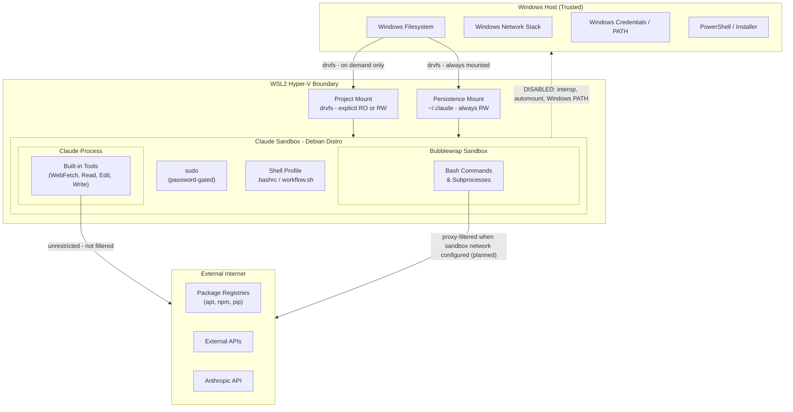

# Threat Model

## 1. Purpose and Scope

Claude Sandbox is a WSL2-based Debian environment on Windows that isolates Claude Code from the host system. This threat model covers threats arising from Claude Code's execution within the sandbox, including filesystem access, command execution, network activity, and privilege escalation. Out of scope: physical access attacks, nation-state threats, attacks on the Windows host from external networks, and vulnerabilities in WSL2 or Windows itself.

## 2. Protected Assets

| Asset                                          | Sensitivity | Notes                                                                      |
| ---------------------------------------------- | ----------- | -------------------------------------------------------------------------- |
| Host filesystem (Windows drives, other distros) | HIGH        | Primary containment goal; interop and automount disabled                   |
| Host network and services                      | HIGH        | WSL2 Hyper-V boundary provides partial isolation                           |
| Windows user account and credentials           | HIGH        | Windows PATH excluded; interop disabled                                    |
| API keys / connection strings in project files | HIGH        | Present on disk in some projects; readable by Claude if mounted RW         |
| Claude API credentials                         | HIGH        | Stored in persistence mount; always accessible to Claude process           |
| Company / client intellectual property in code | HIGH        | Projects may be under NDA; exfiltration is a realistic concern             |
| Active project source code                     | MEDIUM      | Mounted explicitly; RO or RW controlled per session                        |
| Claude session state and settings              | MEDIUM      | Persistence mount is always RW; Claude can modify its own settings         |
| Other projects not currently mounted           | LOW         | Not accessible until explicitly mounted via switch-project                 |

## 3. Deployment Scenarios

**Scenario A - Supervised session**

The developer is present and watching Claude work. They can intervene, approve, or reject actions in real time. Permission modes (plan / acceptEdits) are the primary control. Risk: LOW for destructive actions; MEDIUM for data exposure.

**Scenario B - Unattended session**

The developer is working in a different window or away from the machine. Claude may run bash commands, edit files, and install packages without real-time oversight. Permission modes may be pre-approved. No human in the loop for individual actions. Risk: HIGH. This scenario drives the requirement for hard sandbox controls that do not depend on user vigilance.

## 4. Trust Boundaries

| Boundary                         | Enforced by                   | Status                                |
| -------------------------------- | ----------------------------- | ------------------------------------- |
| WSL2 Hyper-V VM                  | Windows / Hyper-V             | Automatic - not configurable          |
| Windows interop disabled         | wsl.conf (S-001)              | Sandbox-enforced                      |
| Windows PATH excluded            | wsl.conf (S-002)              | Sandbox-enforced                      |
| Automount disabled               | wsl.conf (S-003)              | Sandbox-enforced                      |
| Project mount RO/RW              | User flag at mount time       | User-controlled - not enforced        |
| Outbound network (bash)          | Sandbox network proxy         | Planned - not yet deployed            |
| Outbound network (WebFetch)      | No control exists             | Unmitigated - accepted gap            |
| sudo escalation                  | Password prompt (S-007)       | Sandbox-enforced                      |

## 5. Threat Actors

| Actor                                              | Entry Point                                | Goal                                                   | In Scope? |
| -------------------------------------------------- | ------------------------------------------ | ------------------------------------------------------ | --------- |
| Malicious code executed by Claude                  | Bash command or package install             | Exfiltrate credentials, damage host filesystem          | YES       |
| Prompt injection via project files                 | Claude reads a source file with injections  | Cause Claude to act outside intended scope              | YES       |
| Prompt injection via web content                   | Claude fetches a URL with injected content  | Same as above                                           | YES       |
| Compromised npm / pip / apt package                | Package installed during a session          | Exfiltrate data, establish persistence inside sandbox   | YES       |
| Claude acting outside intended scope               | Any tool - misunderstanding or hallucination | Modify wrong files, delete data, access wrong projects | YES       |
| Malicious project code crafted to exploit Claude   | Claude reads source files                   | Escape sandbox, pivot to other projects or host         | YES       |
| External attacker via network                      | No inbound services exposed                 | N/A                                                    | NO        |
| Physical access to machine                         | Out of scope                                | N/A                                                    | NO        |
| Nation-state / APT                                 | Out of scope                                | N/A                                                    | NO        |

## 6. STRIDE Analysis

### A. WSL2 Boundary

| Threat Type            | Scenario                                           | Mitigated?   | Control                                                  | Residual Risk                                                      |
| ---------------------- | -------------------------------------------------- | ------------ | -------------------------------------------------------- | ------------------------------------------------------------------ |
| Spoofing               | Sandbox process impersonates Windows host process  | Partial      | Interop disabled (S-001); no Windows executable access   | Kernel-level exploit could break this                              |
| Tampering              | Sandbox modifies Windows host files                | Mitigated    | Automount disabled (S-003); no drive access without mount | Explicitly mounted RW projects are writable                       |
| Repudiation            | Actions inside sandbox leave no trace              | Partial      | Bash history timestamped (S-018); git audit trail        | No kernel-level audit (auditd not used on WSL2)                    |
| Info Disclosure        | Sandbox reads host files outside mounted projects  | Mitigated    | Automount disabled (S-003); fstab-only (S-019); PATH excluded (S-002) | Persistence mount and active project mount are accessible |
| Denial of Service      | Sandbox exhausts host CPU / memory                 | Partial      | WSL2 VM provides some isolation                          | No resource quotas configured - accepted gap                       |
| Elevation of Privilege | Sandbox process gains Windows host privileges      | Partial      | Interop disabled (S-001); protectBinfmt (S-004)          | WSL2 is not a full VM; kernel exploit could escalate               |

### B. Project Mount System

| Threat Type            | Scenario                                                | Mitigated? | Control                                                     | Residual Risk                                                                  |
| ---------------------- | ------------------------------------------------------- | ---------- | ----------------------------------------------------------- | ------------------------------------------------------------------------------ |
| Spoofing               | Claude accesses a project by forging its mount path     | Mitigated  | Path traversal validation (S-012) rejects names with / \ .. |                                                                                |
| Tampering              | Claude modifies files in a RO-mounted project           | Mitigated  | Explicit --ro flag enforced at mount; remount detection      | User must choose RO at mount time - not automatic                              |
| Info Disclosure        | Claude reads credentials in a mounted project           | Partial    | RO mount prevents writes; does not prevent reads             | If project contains .env or keys and is mounted, Claude can read them          |
| Info Disclosure        | Claude accesses projects not currently mounted           | Mitigated  | Mount-on-demand; fstab-only mounts (S-019)                  |                                                                                |
| Elevation of Privilege | Path traversal escapes mount point to host filesystem   | Mitigated  | Project name validation (S-012)                             |                                                                                |

### C. Persistence Mount (.claude directory)

| Threat Type     | Scenario                                                    | Mitigated?     | Control                                                     | Residual Risk                                                                                        |
| --------------- | ----------------------------------------------------------- | -------------- | ----------------------------------------------------------- | ---------------------------------------------------------------------------------------------------- |
| Tampering       | Claude modifies its own tool deny lists or permission settings | Not mitigated | Mount security (S-010, S-011) protects permissions not content | A compromised session can widen its own permissions. Managed settings (planned) will partially fix. |
| Info Disclosure | Claude reads its own conversation history, API credentials  | Accepted       | Required for Claude to function; no mitigation planned       | All session state is readable by Claude - by design                                                  |
| Repudiation     | Changes to Claude settings leave no audit trail             | Partial        | Git trail covers project changes; settings changes not tracked | ConfigChange hooks (planned) would address this                                                     |

### D. Claude Permission System

| Threat Type            | Scenario                                          | Mitigated?       | Control                                                     | Residual Risk                                                                        |
| ---------------------- | ------------------------------------------------- | ---------------- | ----------------------------------------------------------- | ------------------------------------------------------------------------------------ |
| Elevation of Privilege | Claude runs --dangerously-skip-permissions         | Not enforced     | User-selected mode; sandbox cannot prevent it               | In unattended Scenario B, if user pre-approves, no runtime enforcement exists        |
| Elevation of Privilege | Claude escalates to root via sudo                 | Mitigated        | Password-gated sudo (S-007); requires human to type password | Unattended sessions cannot sudo without pre-cached credentials                      |
| Tampering              | Claude widens its own permissions mid-session      | Planned          | Managed settings file (planned) will enforce deny rules      | Until deployed: no runtime enforcement. ConfigChange hooks (planned) would add audit |

### E. Bash Command Execution (Bubblewrap)

| Threat Type     | Scenario                                           | Mitigated?       | Control                                                             | Residual Risk                                                      |
| --------------- | -------------------------------------------------- | ---------------- | ------------------------------------------------------------------- | ------------------------------------------------------------------ |
| Info Disclosure | Sandboxed bash exfiltrates data over network       | Planned          | Sandbox network proxy with allowedDomains - planned, not deployed   | Until deployed: bash has unrestricted outbound access              |
| Info Disclosure | Compromised package beacons home during install    | Planned          | Same as above                                                       |                                                                    |
| Tampering       | Bash command escapes bubblewrap sandbox             | Partial          | Bubblewrap namespaces (S-009); unprivileged user namespaces required | Depends on kernel version; failIfUnavailable not yet configured   |
| Denial of Service | Bash process exhausts resources                  | Partial          | WSL2 VM boundary                                                    | No per-process quotas                                              |

> **Note on CVE-2025-66479:** A logic bug in Claude Code <= v2.0.55 caused the sandbox
> network proxy to silently not start when allowedDomains was set to [] (empty array).
> The intended behavior - "block all outbound network" - had no effect.
> Fixed in v2.0.55. Verify your Claude Code version is above this before relying
> on allowedDomains for network control.

## 7. Accepted Risks

| Risk                                                           | Justification                                                                                                              | What Would Change This                                                                                      |
| -------------------------------------------------------------- | -------------------------------------------------------------------------------------------------------------------------- | ----------------------------------------------------------------------------------------------------------- |
| Outbound network not filtered at host level                    | WSL2 NAT architecture makes host-level rules unreliable. Sandbox network proxy (planned) will mitigate bash traffic.       | WSL2 gains reliable firewall integration, or user deploys a host-side proxy.                                |
| Claude can read credentials in mounted RW project directories  | drvfs does not support per-file ACLs inside the mount. No control short of keeping credentials out of project directories. | PreToolUse hook (planned) to detect and block reads of .env / *.config / connection string patterns.         |
| Claude can modify its own settings via persistence mount       | Required for Claude to function.                                                                                           | Managed settings file (planned) takes precedence; does not prevent writes but overrides them at runtime.     |
| Claude Code installed via curl-pipe-bash with no checksum      | No alternative distribution from Anthropic. HTTPS mitigates MITM but not server-side compromise.                           | Anthropic publishes an apt, npm, or brew package.                                                            |
| Claude Code self-updates without version control               | No --no-auto-update flag exists. External tool managed by Anthropic.                                                       | Anthropic adds version pinning support.                                                                      |
| No kernel-level audit trail                                    | auditd is unreliable on WSL2 kernels. Bash history (S-018) and git trail are sufficient for current threat model.          | Enterprise / compliance deployment requiring full audit trail.                                                |
| Unattended sessions have no runtime human oversight            | By design - Scenario B is an accepted use case. Sandbox limits blast radius.                                                | PreToolUse hooks (planned) add runtime validation for dangerous patterns.                                    |
| WebFetch not filtered by any sandbox control                   | Claude's built-in tools run outside bubblewrap. No application-layer proxy exists for them.                                | Claude Code exposes a hook or proxy interface for built-in tool network calls.                                |

## 7.5 Planned Mitigations

Controls not yet implemented but actively tracked in [security-posture-details.md](../plans/security-posture-details.md). When deployed, the corresponding Accepted Risk row will be updated.

| Control                                                         | Threat It Closes                                      | Priority |
| --------------------------------------------------------------- | ----------------------------------------------------- | -------- |
| Sandbox network proxy (allowedDomains)                          | Unrestricted outbound bash traffic                    | HIGH     |
| sandbox.failIfUnavailable                                       | Silent fallback to unsandboxed execution              | MEDIUM   |
| Managed settings file (/etc/claude-code/managed-settings.json)  | Claude self-modifying permissions; bypass mode         | MEDIUM   |
| Managed policy CLAUDE.md (/etc/claude-code/CLAUDE.md)           | No org-wide Claude behavior baseline                  | MEDIUM   |
| PreToolUse hooks                                                | Runtime blocking of credential reads, dangerous patterns | MEDIUM |
| ConfigChange hooks                                              | Unaudited settings changes mid-session                | LOW      |

## 8. Security Controls Reference

For the full controls matrix with implementation status and verification check codes, see [plans/security-posture.md](../plans/security-posture.md).

For detailed gap analysis, implementation notes, and research for unimplemented controls, see [plans/security-posture-details.md](../plans/security-posture-details.md).

For vulnerability reporting, see [SECURITY.md](../SECURITY.md).
