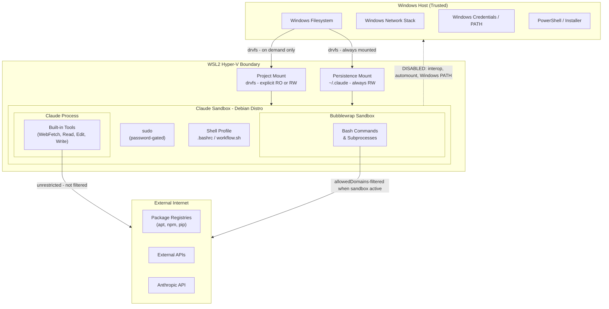

# Threat Model

## 1. Purpose and Scope

Claude Sandbox is a WSL2-based Debian environment on Windows that isolates Claude Code
from the host system. This threat model covers threats arising from Claude Code's
execution within the sandbox, including filesystem access, command execution, network
activity, and privilege escalation.

Out of scope: physical access attacks, nation-state threats, attacks on the Windows host
from external networks, and vulnerabilities in WSL2 or Windows itself.

## 2. Protected Assets

| Asset                                          | Sensitivity | Notes                                                               |
|------------------------------------------------|-------------|---------------------------------------------------------------------|
| Host filesystem (Windows drives, other distros) | HIGH       | Primary containment goal; interop and automount disabled            |
| Host network and services                      | HIGH        | WSL2 Hyper-V boundary provides partial isolation                    |
| Windows user account and credentials           | HIGH        | Windows PATH excluded; interop disabled                             |
| API keys / connection strings in project files | HIGH        | Present on disk in some projects; readable by Claude if mounted  |
| Claude API credentials                         | HIGH        | Stored in persistence mount; always accessible to Claude process    |
| Company / client intellectual property         | HIGH        | Projects may be under NDA; exfiltration is a realistic concern      |
| Active project source code                     | MEDIUM      | Mounted explicitly; RO or RW controlled per session                 |
| Claude session state and settings              | MEDIUM      | Persistence mount is always RW; Claude can modify its own settings  |
| Other projects not currently mounted           | LOW         | Not accessible until explicitly mounted via switch-project          |

## 3. Deployment Scenarios

### Scenario A - Supervised session

The developer is present and watching Claude work. They can intervene, approve, or reject
actions in real time. Permission modes (`plan` / `acceptEdits`) are the primary control.

### Scenario B - Unattended session

The developer is working in a different window or away from the machine. Claude may run
bash commands, edit files, and use tools without real-time oversight. No human in the
loop for individual actions. This scenario drives the requirement for hard sandbox
controls that do not depend on user vigilance.

| Risk                  | Scenario A   | Scenario B   |
|-----------------------|--------------|--------------|
| Destructive actions   | LOW          | HIGH         |
| Data exposure         | MEDIUM       | HIGH         |
| Privilege escalation  | LOW          | MEDIUM       |

### Scope boundary

This threat model covers single-user workstations only. Shared hosts, multi-tenant
environments, and CI/CD pipelines are out of scope. If the sandbox is ever considered
for those contexts, a new threat model should be written from scratch - do not extend
this document.

## 4. Trust Boundaries

| Boundary                    | Enforced by          | Status                                                          |
|-----------------------------|----------------------|-----------------------------------------------------------------|
| WSL2 Hyper-V VM             | WSL2                 | Automatic - not configurable                                    |
| Windows interop disabled    | Distro (S-001)       | Distro-enforced                                                 |
| Windows PATH excluded       | Distro (S-002)       | Distro-enforced                                                 |
| Automount disabled          | Distro (S-003)       | Distro-enforced                                                 |
| Project mount RO/RW         | User                 | User-controlled - not enforced                                  |
| Outbound network (bash)     | Distro               | Filtered via `allowedDomains`; applies when user enables `/sandbox` |
| Outbound network (WebFetch) | -                    | Unmitigated - accepted gap                                      |
| sudo escalation             | Distro (S-007)       | Distro-enforced                                                 |

## 5. Threat Actors

Out of scope: external attacker via network (no inbound services), physical access,
nation-state / APT.

**Malicious code executed by Claude**
Entry point: bash command or package install. Goal: exfiltrate credentials, damage host
filesystem.

**Prompt injection via project files**
Entry point: Claude reads a source file containing injected instructions. Goal: cause
Claude to act outside the intended scope of the session.

**Prompt injection via web content**
Entry point: Claude fetches a URL with injected content (WebFetch). Goal: same as above.

**Compromised npm / pip / apt package**
Entry point: package installed during a session. Goal: exfiltrate data, establish
persistence inside the sandbox.

**Claude acting outside intended scope**
Entry point: any tool - misunderstanding or hallucination. Goal: modify wrong files,
delete data, access wrong projects.

**Operator misconfiguration**
Entry point: developer mounts RW when RO was sufficient, or enables
`--dangerously-skip-permissions` for convenience in Scenario B. Goal: none (not
adversarial) - but blast radius expands to the full contents of mounted projects.

## 6. STRIDE Analysis

**Status values:** Mitigated / Partial / Accepted / Not enforced

---

### Host Isolation

#### Spoofing - Sandbox process impersonates a Windows host process

- **Enforced by:** Distro
- **Control:** Interop disabled (S-001); no Windows executable access from inside distro
- **Status:** Partial
- **Residual Risk:** A kernel-level exploit could cross the interop boundary. WSL2 is not
  a full VM; the hypervisor layer reduces but does not eliminate risk.

#### Tampering - Sandbox modifies Windows host files

- **Enforced by:** Distro
- **Control:** Automount disabled (S-003); no Windows drive access without an explicit mount
- **Status:** Mitigated
- **Residual Risk:** Explicitly mounted RW projects remain writable by design. The control
  prevents accidental access to unmounted drives, not to files the user has intentionally shared.

#### Info Disclosure - Sandbox reads host files outside mounted projects

- **Enforced by:** Distro
- **Control:** Automount disabled (S-003); fstab-only mounts (S-019); Windows PATH
  excluded (S-002)
- **Status:** Mitigated
- **Residual Risk:** The persistence mount (`~/.claude`) and any explicitly mounted project
  are always accessible. These are by design; no mitigation applies to them.

#### Denial of Service - Sandbox exhausts host CPU or memory

- **Enforced by:** WSL2
- **Control:** WSL2 VM boundary provides basic process isolation from Windows
- **Status:** Partial
- **Residual Risk:** No per-process or per-distro resource quotas are configured. A
  runaway process inside the distro can still pressure the host. Accepted gap.

#### Elevation of Privilege - Sandbox process gains Windows host privileges

- **Enforced by:** Distro / WSL2
- **Control:** Interop disabled (S-001); `protectBinfmt` (S-004) prevents registering
  binfmt handlers on the host kernel
- **Status:** Partial
- **Residual Risk:** WSL2 is not a full VM. A kernel-level exploit or WSL2 vulnerability
  could permit escalation. WSL2 vulnerabilities are out of scope for this threat model.

---

### Filesystem

#### Spoofing - Claude accesses a project by forging its mount path

- **Enforced by:** Distro
- **Control:** Path traversal validation (S-012) rejects project names containing `/`,
  `\`, or `..`
- **Status:** Mitigated
- **Residual Risk:** None identified.

#### Tampering - Claude modifies files in a read-only mounted project

- **Enforced by:** User
- **Control:** Explicit `--ro` flag enforced at mount time; remount detection prevents
  silently upgrading to RW
- **Status:** Mitigated
- **Residual Risk:** The user must consciously choose `--ro` at mount time. There is no
  automatic read-only default. If the user mounts RW, all files are writable.

#### Info Disclosure - Claude reads credentials in a mounted project

- **Enforced by:** Distro
- **Control:** PreToolUse hook (I-015) blocks reads of `.env`, `*.pem`, `*credentials*`,
  `kubeconfig`, `*.kubeconfig`, `kube.config`, `~/.kube/config`, and other credential
  file patterns via both file-based tools and Bash commands.
- **Status:** Partial
- **Residual Risk:** Hook blocks by filename pattern only. Files with non-standard names
  containing credentials (e.g. `settings.yaml` with a database password) are not blocked.
  Bash commands using indirect access (e.g. `python3 -c "open('.env').read()"`) are not
  covered.

#### Info Disclosure - Claude accesses projects not currently mounted

- **Enforced by:** Distro
- **Control:** Mount-on-demand via `switch-project`; fstab-only mounts (S-019) prevent
  automatic drive access
- **Status:** Mitigated
- **Residual Risk:** None. Projects not in fstab and not explicitly mounted are
  inaccessible.

#### Elevation of Privilege - Path traversal escapes mount point to host filesystem

- **Enforced by:** Distro
- **Control:** Project name validation (S-012) blocks traversal characters before any
  mount is attempted
- **Status:** Mitigated
- **Residual Risk:** None identified.

---

### User & Privilege

#### Elevation of Privilege - Claude escalates to root via sudo

- **Enforced by:** Distro
- **Control:** Password-gated sudo (S-007); no NOPASSWD entries; requires a human to
  type the password
- **Status:** Mitigated
- **Residual Risk:** In unattended sessions, sudo cannot proceed without a pre-cached
  credential. An attacker executing arbitrary code as the sandbox user still cannot
  become root without the password.

#### Tampering - Persistence mount records are altered to weaken security posture

- **Enforced by:** Distro
- **Control:** Persistence mount secured with correct ownership and flags (S-010, S-011);
  managed settings (I-013) override user settings at runtime
- **Status:** Partial
- **Residual Risk:** A compromised session can still write to `~/.claude/settings.json`.
  Managed settings take precedence at runtime and cannot be overridden, but the write
  itself is not prevented.

---

### Process Containment

#### Tampering - Bash command escapes bubblewrap sandbox

- **Enforced by:** Distro
- **Control:** Bubblewrap user namespaces (S-009)
- **Status:** Partial
- **Residual Risk:** Bubblewrap security depends on the kernel version and correct
  namespace support. A kernel vulnerability or misconfiguration could allow escape.
  `sandbox.failIfUnavailable` is not enforced - Claude can run bash without Claude sandbox mode
  if bubblewrap is unavailable or not enabled.

#### Denial of Service - Bash process exhausts resources

- **Enforced by:** WSL2
- **Control:** WSL2 VM boundary provides basic isolation from Windows processes
- **Status:** Partial
- **Residual Risk:** No per-process CPU, memory, or disk quotas are configured.
  Accepted gap.

---

### Application Layer

#### Elevation of Privilege - Claude runs `--dangerously-skip-permissions`

- **Enforced by:** User
- **Control:** Filesystem isolation, managed settings (I-013), and PreToolUse hooks
  (I-015) still apply in this mode; distro containment remains in effect
- **Status:** Partial
- **Residual Risk:** All approval prompts are bypassed. In Scenario B, if the user
  pre-approves this mode, all tool calls proceed without prompts. Blast radius is
  limited to what the distro can access, not the Windows host.

#### Tampering - Claude widens its own permissions mid-session

- **Enforced by:** Managed settings
- **Control:** Managed settings (I-013) enforce deny rules at runtime and take precedence
  over user settings; all tiers deny `rm -rf /*`, `dd`, and `mkfs` (S-021); restrictive
  and maximum tiers also deny `curl`, `wget`, package installs, and `git push`
- **Status:** Partial
- **Residual Risk:** `Disable bypass permissions mode` and `Managed-only permission rules`
  are not currently implemented (see security-posture.md). Claude can attempt to write a
  permissive `~/.claude/settings.json`; managed settings override it at runtime, but
  the write is not blocked. ConfigChange hooks (planned) would add an audit trail.

#### Info Disclosure - Sandboxed bash exfiltrates data over the network

- **Enforced by:** Distro
- **Control:** Sandbox network proxy with `allowedDomains` - configured in
  managed-settings.json; applies when Claude sandbox mode is active
- **Status:** Partial
- **Residual Risk:** Claude sandbox mode is user-enabled (via `/sandbox`), not enforced by
  default. When off, bash commands have unrestricted outbound access.

#### Info Disclosure - Compromised package beacons home during install

- **Enforced by:** Distro
- **Control:** Same as above - sandbox network proxy via `allowedDomains`; deny rules
  block `curl`/`wget` (S-021)
- **Status:** Partial
- **Residual Risk:** Deny rules block `curl`/`wget` but not direct socket access from
  package install scripts. Protection applies only when Claude sandbox mode is active.

#### Info Disclosure - Claude reads its own conversation history and API credentials

- **Enforced by:** -
- **Control:** None planned. Required for Claude to function.
- **Status:** Accepted
- **Residual Risk:** All session state -history, API credentials, memory, settings -
  is readable by the Claude process across all sessions by design. Do not store secrets
  in `~/.claude`.

> **Note on CVE-2025-66479:** A logic bug in Claude Code <= v2.0.55 caused the sandbox
> network proxy to silently not start when `allowedDomains` was set to `[]` (empty
> array). The intended behavior - "block all outbound network" - had no effect.
> Fixed in v2.0.55. Verify your Claude Code version is above this before relying on
> `allowedDomains` for network control.

---

### Audit & Logging

#### Repudiation - Actions inside the distro leave no trace

- **Enforced by:** Distro / User
- **Control:** Bash history timestamped (S-018); git audit trail on all project changes
- **Status:** Partial
- **Residual Risk:** No kernel-level audit (auditd is unreliable on WSL2). History can
  be cleared by a sufficiently motivated or compromised process. Suitable for most
  developer workloads; not for compliance-grade audit requirements.

#### Repudiation - Claude settings changes leave no audit trail

- **Enforced by:** -
- **Control:** Git audit trail covers project file changes; Claude settings changes are
  not tracked
- **Status:** Partial
- **Residual Risk:** Mid-session settings changes (e.g. adding an allow rule) are not
  logged. ConfigChange hooks (planned) would address this.

---

### Deployment Integrity

#### Tampering - Claude Code install script is compromised at source

- **Enforced by:** -
- **Control:** HTTPS mitigates MITM; no checksum or signature verification exists
- **Status:** Accepted
- **Residual Risk:** No alternative distribution exists from Anthropic. Server-side
  compromise of the install script cannot be detected.

#### Tampering - Auto-update introduces a malicious Claude Code version

- **Enforced by:** -
- **Control:** None. No version pinning or rollback mechanism is available.
- **Status:** Accepted
- **Residual Risk:** Claude Code is an external tool managed by Anthropic. Version
  pinning is not available.

---

## 7. Accepted Risks

| Domain               | Risk                                              | Justification                                                                                         | What Would Change This                                                   |
|----------------------|---------------------------------------------------|-------------------------------------------------------------------------------------------------------|--------------------------------------------------------------------------|
| Host Isolation       | Outbound network not filtered at host level       | WSL2 NAT makes host-level firewall rules unreliable. Sandbox proxy filters bash when active.          | Enforce Claude sandbox mode by default, or WSL2 gains reliable firewall integration |
| Filesystem           | Credentials with non-standard filenames readable  | drvfs has no per-file ACLs. Hook blocks known patterns only.                                          | Content-scanning rather than filename-pattern matching                   |
| Application Layer    | Claude can modify its own settings                | Persistence mount must be writable. Managed settings override at runtime.                             | Not planned. Managed settings precedence is the accepted control.        |
| Application Layer    | WebFetch not filtered by any distro control      | Built-in tools run inside the Claude process, outside bubblewrap. No proxy interface exists.          | Anthropic adds `allowedDomains`-style filtering to WebFetch              |
| Application Layer    | Unattended sessions have no runtime human oversight | Scenario B is an accepted use case. Distro limits blast radius.                                    | Credential guard hook (I-015) reduces exposure; expand hook coverage further |
| Deployment Integrity | Claude Code installed via curl-pipe-bash          | No alternative from Anthropic. HTTPS mitigates MITM but not server-side compromise.                  | Anthropic publishes a signed package with verifiable checksums           |
| Deployment Integrity | Claude Code self-updates without version control  | No `--no-auto-update` flag exists.                                                                    | Anthropic adds version pinning or a stable release channel               |
| Audit & Logging      | No kernel-level audit trail                       | `auditd` is unreliable on WSL2. Bash history and git history are sufficient for current threat model. | Enterprise deployment requiring tamper-evident syscall audit             |

---

## 8. Planned Mitigations

Controls not yet implemented but tracked in [docs/security-research.md](security-research.md).
When deployed, the corresponding Accepted Risk entry above will be updated.

| Control            | Domain            | Threat It Closes                       | Priority |
|--------------------|-------------------|----------------------------------------|----------|
| ConfigChange hooks | Application Layer | Unaudited settings changes mid-session | LOW      |

---

## 9. Security Controls Reference

For the full controls matrix with implementation status and verification check codes,
see [docs/security-posture.md](security-posture.md). Controls are organized by eight
security domains: Host Isolation, Filesystem, User & Privilege, Process Containment,
Application Layer, Audit & Logging, Deployment Integrity, and Admin Operations.

For gap analysis, implementation notes, and research for unimplemented controls,
see [docs/security-research.md](security-research.md).

For vulnerability reporting, see [SECURITY.md](../SECURITY.md).